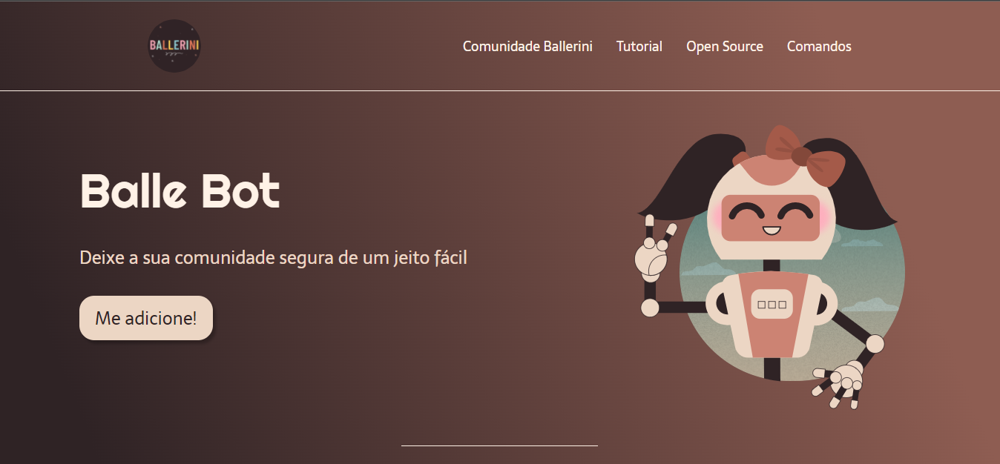

# BalleBot - Landing Page

> Landing page desenvolvida para um robô moderador de comunidade do Discord, BalleBot. Criado com base no projeto de Rafaella Ballerini: https://www.youtube.com/watch?v=llF6vD-RljE

## Ajustes e melhorias

O projeto foi finalizado de acordo com as seguintes tarefas:

- [x] Criação de HTML
- [x] Criação de CSS

### 🤝 Colaboradores

Agradecemos às seguintes pessoas que contribuíram para este projeto:

<table>
  <tr>
    <td align="center">
      <a href="#">
         
        
          <b>Suzana Fonseca</b>
        
      </a>
    </td>
  </tr>
</table>
